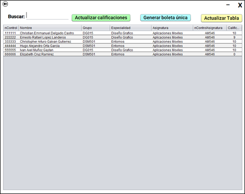

# Sistema de Gestión Escolar / School Management System

_Español_

Este proyecto es un sistema de gestión escolar desarrollado en Java Swing. Proporciona una interfaz gráfica intuitiva y funcionalidades para administrar estudiantes, asignaturas, calificaciones, etc. El sistema está diseñado para facilitar la administración eficiente de una institución educativa. Ademas de que tiene funcionalidades extras como la importación de archivos Excel, ya que esta pensado para trabajar en conjunto con Google Classroom. También cuenta con la generación automática de boletas de calificaciones.
Nota: Este sistema esta diseñado para la empresa ICIIBA, por lo que se recomienda utilizar este proyecto unicamente de ejemplo, ya que incluso la base de datos solamente es un prototipo que contiene lo necesario para funcionar.

_English_

This project is a school management system developed in Java Swing. It provides an intuitive graphical interface and functionalities to manage students, subjects, grades, etc. The system is designed to facilitate the efficient administration of an educational institution. It also has extra features such as importing Excel files, as it is designed to work in conjunction with Google Classroom. It also has the automatic generation of report cards.
Note: This system is designed for the company ICIIBA, so it is recommended to use this project only as an example, since even the database is only a prototype that contains what is necessary to work.

## Características / Features

_Español_

- Gestión de estudiantes: Se pueden cambiar las calificaciones e imprimir las boletas individualmente.
- Gestión de Grupos: Se pueden administrar los grupos, lo que incluye agregarle asignaturas, una vez gestionando el grupo podemos imprimir la boleta individual de los alumnos asi como imprimir la boleta de todo el grupo. La ruta donde se almacenaran las calificaciones es:
C:/User/Documents/IciibaBoletas/Grupo/
- Gestión de asignaturas: Crear, modificar y eliminar asignaturas.
- Modulo de importación de datos: Este modulo se encarga de importar las calificaciones mediante un archivo Excel, hay una opción para descargar un archivo de plantilla, que funciona como un ejemplo de como debe estar estructurado el archivo Excel.

_English_

- Student management: You can change grades and print report cards individually.
- Group Management: You can manage groups, which includes adding subjects, once you manage the group you can print the individual report card of the students as well as print the report card of the whole group. The route where the grades will be stored is:
C:/User/Documents/IciibaBoletas/Grupo/
- Subject management: Create, modify and delete subjects.
- Data import module: This module is responsible for importing grades through an Excel file, there is an option to download a template file, which works as an example of how the Excel file should be structured.

## Requisitos del Sistema / System Requirements

_Español_

- Java Development Kit (JDK) 17 o superior.
- IDE de desarrollo Java (como Eclipse, NetBeans o IntelliJ IDEA).
(En mi caso utilicé NetBeans IDE 14)
- Conexión a una base de datos compatible (como MySQL o SQL Server).

_English_

- Java Development Kit (JDK) 17 or higher.
- Java development IDE (such as Eclipse, NetBeans or IntelliJ IDEA).
(In my case I used NetBeans IDE 14).
- Connection to a compatible database (such as MySQL or SQL Server).

## Tecnologías Utilizadas / Technologies Used

_Español_

- Java Swing: Framework de interfaz gráfica para la construcción de la interfaz de usuario.
- XMLBeans: Biblioteca de Java que permite la manipulación y procesamiento de documentos XML de forma sencilla y eficiente.
- SQL Server o MySQL: Base de datos utilizada para almacenar la información del sistema.
- JDBC: API de Java para interactuar con la base de datos.
- POI: La biblioteca POI se utiliza para el manejo de documentos de Microsoft Office, como archivos de Excel y Word. Esta biblioteca nos permite generar, leer y manipular estos tipos de archivos desde el sistema, proporcionando una integración eficiente con las funcionalidades del proyecto.
- Log4j: La biblioteca Log4j se ha utilizado para la implementación de un sistema de registro de eventos y mensajes. Permite generar registros detallados y personalizables, lo que facilita la depuración y el monitoreo del sistema durante la ejecución.
- PDFBox: Se ha empleado la biblioteca PDFBox para la manipulación de archivos PDF. Esto nos ha permitido generar y modificar archivos PDF directamente desde el sistema, brindando la capacidad de generar las boletas de calificaciones de cada alumno.

_English_

- Java Swing: Graphical interface framework for building the user interface.
- XMLBeans: Java library that allows the manipulation and processing of XML documents in a simple and efficient way.
- SQL Server or MySQL: Database used to store system information.
- JDBC: Java API to interact with the database.
- POI: The POI library is used to handle Microsoft Office documents, such as Excel and Word files. This library allows us to generate, read and manipulate these types of files from the system, providing an efficient integration with the project functionalities.
- Log4j: The Log4j library has been used for the implementation of an event and message logging system. It allows generating detailed and customizable logs, which facilitates debugging and monitoring of the system during execution.
- PDFBox: The PDFBox library has been used for PDF file manipulation. This has allowed us to generate and modify PDF files directly from the system, providing the ability to generate report cards for each student.

## Instrucciones de Instalación / Installation Instructions

_Español_

1. Clona el repositorio o descarga el código fuente del proyecto.

2. Importa el proyecto en tu IDE de desarrollo Java.

3. Configura la base de datos con los campos necesarios, puedes utilizar el archivo iciibaSFR.bacpac si estas utilizando SQL Server o crear las tablas manualmente si utilizar otro gestor.

3. Configura la conexión a la base de datos en el archivo de configuración `config.XML`. SI no has hecho un clean and build deberás colocar las credenciales de tu gestor de base de datos en el archivo creado en la carpeta raíz, si ya lo has compilado debes copiar este archivo a la carpeta dist

4. Compila y ejecuta el proyecto desde tu IDE.

_English_

1. Clone the repository or download the source code of the project.

2. Import the project into your Java development IDE.

3. Configure the database with the necessary fields, you can use the iciibaSFR.bacpac file if you are using SQL Server or create the tables manually if you are using another manager.

3. Configure the connection to the database in the configuration file `config.XML`. If you have not done a clean and build you must place the credentials of your database manager in the file created in the root folder, if you have already compiled it you must copy this file to the dist folder.

4. Compile and run the project from your IDE.

## Instrucciones de Uso / Instructions for Use

_Español_

1. Inicia sesión con las credenciales de administrador, estos datos se encuentran en la tabla empleados.

2. Explora las diferentes funcionalidades del sistema utilizando la interfaz gráfica.

3. Sigue las indicaciones y utiliza los botones y campos correspondientes para gestionar estudiantes, profesores, asignaturas, calificaciones, etc.

_English_

1. Log in with the administrator credentials, this data can be found in the employees table.

2. Explore the different functionalities of the system using the graphical interface.

Follow the prompts and use the corresponding buttons and fields to manage students, teachers, subjects, grades, etc.

## Capturas de Pantalla / Screenshots

### Inicio de sesión / Login

 

_Español_

 
Este modulo es lo primero que veremos al ejecutar el proyecto
 
 

_English_

 
This module is the first thing we will see when executing the project.

### Modulo principal / Main module

 

_Español_

 
En esta sección se puede definir como el menú principal, ademas de mostrar un carrusel de imágenes tenemos el acceso a los demás módulos.
 
 

_English_

 
In this section can be defined as the main menu, besides showing a carousel of images we have the access to the other modules.

### Modulo de asignaturas / Courses Module

 

_Español_

 
Este modulo es para la administración de las asignaturas, tiene las siguientes funciones:
- Crear nueva asignatura
- Modificar la asignatura seleccionada
- Eliminar la asignatura seleccionada
 
 

_English_

 
This module is for the administration of the courses, it has the following functions:
- Create a new course
- Modify the selected course
- Delete the selected course

### Modulo de alumnos / Students module

 

_Español_

 
Este modulo muestra todos los alumnos, tiene las siguientes características;
- Filtrar o buscar por el numero de control
- Seleccionar a un alumno y poder imprimir su boleta individual
- Seleccionar un alumno para poder cambiar su calificación y que nos envía al modulo de calificación
 
 

_English_

 
This module shows all students, it has the following features;
- Filter or search by control number.
- Select a student and be able to print his individual report card.
- Select a student to be able to change his grade and that sends us to the grading module.

### Cambiando las calificaciones desde el modulo de alumnos / Changing grades from students module

 

_Español_

 
Esta ventana emergente unicamente tiene la función de actualizar la calificación del alumno que tenemos seleccionado desde el modulo de alumnos. Se toma en cuenta lo siguiente:
- numero de control del alumno.
- numero de control de la asignatura.
- nueva calificación.
- calificación registrada.
 
 

_English_

 
This pop-up window only has the function of updating the grade of the student we have selected from the student module. The following is taken into account:
- student control number.
- control number of the subject.
- new grade.
- registered grade.

### Modulo de grupos / Groups module

 

_Español_

 
Este modulo no tiene las opciones típicas de un CRUD, sino que unicamente tiene dos checkbox que tienen la función de filtrar los grupos de la siguiente manera:
- Especialidad
- Horario
- Turno
Una vez seleccionado el grupo podemos dar click al botón de administrar grupo, lo que recogerá los datos grupo y especialidad y nos enviara al siguiente modulo.
 
 

_English_

 
This module does not have the typical options of a CRUD, but only has two checkboxes that have the function of filtering the groups in the following way:
- Specialty
- Schedule
- Shift
Once the group is selected we can click on the manage group button, which will collect the group and specialty data and send us to the next module.

### Administración de grupos / Groups admin

 

_Español_

 
Este modulo es el que mas funciones tiene, las cuales son:
- Mostrar todos los alumnos que estén en este grupo (si no se muestran entonces no hay una asignatura en el grupo).
- Habilitar y deshabilitar la tabla de las asignaturas (por defecto esta desactivada).
- Seleccionar una o mas asignaturas para agregar al grupo
- Seleccionar una o mas asignaturas para eliminar al grupo
- Modificar las calificaciones de forma manual
- Imprimir la boleta del alumno que tengamos seleccionado
- Imprimir la boleta del grupo entero (todas las boletas)
 
 

_English_

 
This module is the one with the most functions, which are:
- Show all the students that are in this group (if they are not shown then there is no subject in the group).
- Enable and disable the table of subjects (by default it is disabled).
- Select one or more subjects to add to the group.
- Select one or more subjects to remove from the group.
- Modify grades manually
- Print the report card of the selected student
- Print the report card of the entire group (all report cards).

### Modulo de importación / Import module

 

_Español_

 
Este apartado permite importar un archivo de excel para un manejo mas rápido de las calificaciones, para evitar confusiones se creo un botón el cual nos descarga una plantilla de ejemplo de como deben de ir estructurados los archivos que debemos importar.
También se ha añadido la funcionalidad de que se haga una búsqueda acorde a los números de control que importemos, si el numero de control es correcto entonces en la tabla se mostrará el nombre del alumno, de la misma manera también con el numero de control de la asignatura.
 
 

_English_

 
This section allows to import an excel file for a faster handling of the grades, to avoid confusion a button was created which downloads an example template of how the files that we must import should be structured.
I've also added the functionality to make a search according to the control numbers that we import, if the control number is correct then the table will show the name of the student, in the same way also with the control number of the subject.

### Ejemplo de boleta / Report card example

 

_Español_

 
Esto es un ejemplo del archivo que se crea cuando generamos una boleta de calificaciones.
 
 

_English_

 
This is an example of the file that is created when we generate a report card.

# IMPORTANTE / IMPORTANT

Si tienes alguna sugerencia, has notado un error o necesitas ayuda con la instalación por favor déjamelo saber.